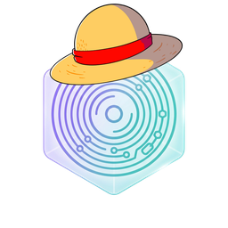

# Punk Records Inference

<p align="center">
  
</p>

<p align="center">
  <strong>KV-state persistence for vLLM</strong> — capture attention + hybrid recurrent state after each agent turn,<br />
  store on disk (<code>.nls</code>), re-inject on the next request so the model skips re-prefilling full history.
</p>

<p align="center">
  <a href="https://github.com/umbecanessa/punk-records-inference/actions/workflows/ci.yml"></a>
  
  
  
</p>

<p align="center">
  <a href="docs/getting-started/installation.md"><strong>Installation</strong></a> ·
  <a href="docs/getting-started/quickstart.md"><strong>Quickstart</strong></a> ·
  <a href="docs/index.md">Docs</a> ·
  <a href="#proof">Proof</a> ·
  <a href="docs/CLIENT_CONTRACT.md">Client contract</a> ·
  <a href="llms.txt">llms.txt</a>
</p>

<p align="center"><sub>
  <b>AI agents / LLMs:</b> read <a href="llms.txt"><code>llms.txt</code></a> for entry points and doc links.
</sub></p>

---

**Press a record of each turn's KV cache. Replay it on the next request instead of re-reading the full transcript.**

PRI is a vLLM plugin: one Docker container, OpenAI-compatible API on port 8000, BYOC model checkpoint. It pairs naturally with agent clients (OpenCode, custom harnesses) and complements text-compression layers like [Headroom](https://github.com/chopratejas/headroom) and agent platforms like [Babo](https://github.com/umbecanessa/babo).

> **Status:** Pre-public release. Docs and presentation are being polished for open source; license TBD.

---

## What it does

- **Turn capture** — serialize attention KV + hybrid recurrent state → compressed `.nls` manifests
- **Chain resume** — inject prior turn state on turn ≥ 2; skip expensive re-prefill
- **Agent middleware** — strip transcript, set `memory_capture_start`, enrich `kv_transfer_params` automatically
- **Optional overflow** — resume + semantic Swiss retrieval when context trim evicts tokens (opt-in profile)
- **Model-aware startup** — probes `config.json` and gates layer env by inject mode

## How it works (30 seconds)

```
Agent client (OpenCode, curl, LangChain)
        │   chat completions + kv_transfer_params
        ▼
┌─────────────────────────────────────────────────────┐
│  vLLM OpenAI API :8000                               │
│  AgentShim  →  strip · capture_start · chain meta   │
│  Connector  →  WRITE .nls  |  READ resume/overflow  │
└─────────────────────────────────────────────────────┘
        │
        ▼
/data/pri  (captures/*.nls + index.jsonl)     /model  (BYOC)
```

→ [Architecture](docs/ARCHITECTURE.md) · [Core concepts](docs/getting-started/concepts.md) · [Client contract](docs/CLIENT_CONTRACT.md)

---

## Proof

GX10 · stock Qwen3.5-35B-A3B-FP8 · 2026-06-23

| Bench | Result | Artifact |
|-------|--------|----------|
| Tier-1 Marco facts (seed 42) | TEXT 5/5 · RESUME 5/5 | `bench/results/tier1_marco_facts_42.json` |
| OpenCode long session (seed 42) | RECALL 6/6 | `bench/results/opencode_long_session.json` |
| Manifest proof turn 2 (KL #648) | `rope_start=24` | `bench/results/manifest_opencode_t2.json` |

Reproduce: [Benchmarks](docs/BENCHMARKS.md) — publication tables expand when bench sweeps complete.

---

## Get started (60 seconds)

```bash
git clone https://github.com/umbecanessa/punk-records-inference.git
cd punk-records-inference

export MODEL_PATH=$HOME/.cache/huggingface/hub/models--Qwen--Qwen3.5-35B-A3B-FP8/snapshots/<revision>
docker compose -f docker/compose.yaml up --build

curl -s http://127.0.0.1:8000/v1/models
```

```bash
# Smoke bench (host Python, live server)
pip install requests
./bench/run_suite.sh --tier 1 --base-url http://127.0.0.1:8000

# Unit tests (no GPU)
pip install pytest torch zstandard && pytest tests/ -q
```

Full guide: [Installation](docs/getting-started/installation.md) · [Quickstart](docs/getting-started/quickstart.md)

---

## Scope (v0.1)

| In scope | Out of scope |
|----------|--------------|
| Turn capture → `.nls` | MoE expert slots / router bias |
| Chain resume inject + RoPE | Legacy CAMM, streaming scorer |
| Optional Swiss retrieval | Hosted Punk Records SaaS |
| Agent middleware (strip + capture) | Model weights (BYOC) |

Env vars keep the `NLS_*` prefix for migration; `PRI_*` rename planned for v0.2.

---

## Repository layout

| Path | Role |
|------|------|
| [`pri/`](pri/) | Python package — connector, store, resume, agent shim, admin |
| [`patches/`](patches/) | vLLM source patches (build time) |
| [`docker/`](docker/) | Dockerfile + compose + `start.sh` |
| [`bench/`](bench/) | Tier-1 + OpenCode harnesses |
| [`spec/`](spec/) | `.nls` manifest schema + validator |
| [`tests/`](tests/) | Unit tests (no GPU) |
| [`docs/`](docs/) | Architecture, client contract, guides |
| [`assets/`](assets/) | Logo, straw-hat mark, banner (see `assets/README.md`) |

---

## Documentation

- **[Documentation home](docs/index.md)** — full map (getting started, guides, reference, internal)
- [Installation](docs/getting-started/installation.md)
- [Quickstart](docs/getting-started/quickstart.md)
- [Core concepts](docs/getting-started/concepts.md)
- [Integrating OpenCode](docs/guides/integrating-opencode.md)
- [Environment variables](docs/reference/env-vars.md)
- [Architecture](docs/ARCHITECTURE.md)
- [Client contract](docs/CLIENT_CONTRACT.md) — `kv_transfer_params`
- [Docker](docs/DOCKER.md)
- [Supported models](docs/SUPPORTED_MODELS.md)
- [Benchmarks](docs/BENCHMARKS.md)
- [Troubleshooting](docs/guides/troubleshooting.md)
- [Limitations](docs/LIMITATIONS.md)

---

## License

TBD — community license + patent notice (provisional 64/050,345). See [Limitations](docs/LIMITATIONS.md).
