# 2 — Token efficiency

PRI RESUME sends **only the latest user message** on recall; prior context lives in injected KV.
TEXT re-prefills the full inline transcript every request.

## Headline — long12 inject compare

| Arm | Mean prompt tok | vs TEXT | Recall @5 |
|-----|----------------:|--------:|----------:|
| TEXT | 3743.2 | — | 5/5 |
| RESUME | 42.2 | **−98.9%** | 5/5 |
| OVERFLOW | 42.2 | **−98.9%** | 5/5 |

**Net savings:** ~3701 prompt tokens per recall request on a 15-turn chain.

## All inject-mode scenarios

| Scenario | TEXT mean | RESUME mean | Δ tokens | Savings % |
|----------|----------:|------------:|---------:|----------:|
| short chain (0 noise) | 446.2 | 42.2 | 404.0 | 90.5% |
| long12 chain | 3743.2 | 42.2 | 3701.0 | 98.9% |
| short OpenRouter TEXT | 402.2 | 42.2 | 360.0 | 89.5% |
| long12 OpenRouter TEXT | 3743.2 | 42.2 | 3701.0 | 98.9% |
| long12 resume_max_tokens=4096 | 3743.2 | 42.2 | 3701.0 | 98.9% |

## Turn sweep — prompt tokens vs checkpoint

| cp | chain inject tok | TEXT prompt (mean) | RESUME prompt (mean) | Savings % |
|----|-----------------:|-------------------:|---------------------:|----------:|
| 20 | 6225 | 6209.2 | 42.2 | 99.3% |
| 40 | 11981 | 11906.2 | 42.2 | 99.6% |
| 60 | 17131 | 17003.2 | 42.2 | 99.8% |
| 80 | 23543 | 23362.2 | 42.2 | 99.8% |

**Key finding:** Token savings stay **>99%** even at cp80 (~23k inject tokens). Recall failure at long context is **not** caused by reverting to inline prefill.

```mermaid
xychart-beta
    title "Mean prompt tokens at recall (turn sweep)"
    x-axis ["cp20", "cp40", "cp60", "cp80"]
    y-axis "prompt tokens" 0 --> 25698.42
    bar "TEXT" [6209.2, 11906.2, 17003.2, 23362.2]
    bar "RESUME" [42.2, 42.2, 42.2, 42.2]
```

```mermaid
xychart-beta
    title "Mean prompt tokens — inject mode compare"
    x-axis ["short (0 noi", "long12", "short OR", "long12 OR", "long12 resum"]
    y-axis "prompt tokens" 0 --> 4117.52
    bar "TEXT" [446.2, 3743.2, 402.2, 3743.2, 3743.2]
    bar "RESUME" [42.2, 42.2, 42.2, 42.2, 42.2]
```

## Per-probe detail (long12, local)

### TEXT arm

| # | Prompt tok | Completion tok | Pass |
|---|----------:|---------------:|:----:|
| 1 | 3745 | 54 | ✓ |
| 2 | 3742 | 31 | ✓ |
| 3 | 3745 | 72 | ✓ |
| 4 | 3742 | 66 | ✓ |
| 5 | 3742 | 151 | ✓ |

### RESUME arm

| # | Prompt tok | Completion tok | Pass |
|---|----------:|---------------:|:----:|
| 1 | 44 | 25 | ✓ |
| 2 | 41 | 21 | ✓ |
| 3 | 44 | 54 | ✓ |
| 4 | 41 | 19 | ✓ |
| 5 | 41 | 43 | ✓ |

Raw: `inject_mode_compare_*_long12_postfix.json`, `turn_sweep_cp20_80_v5.json`