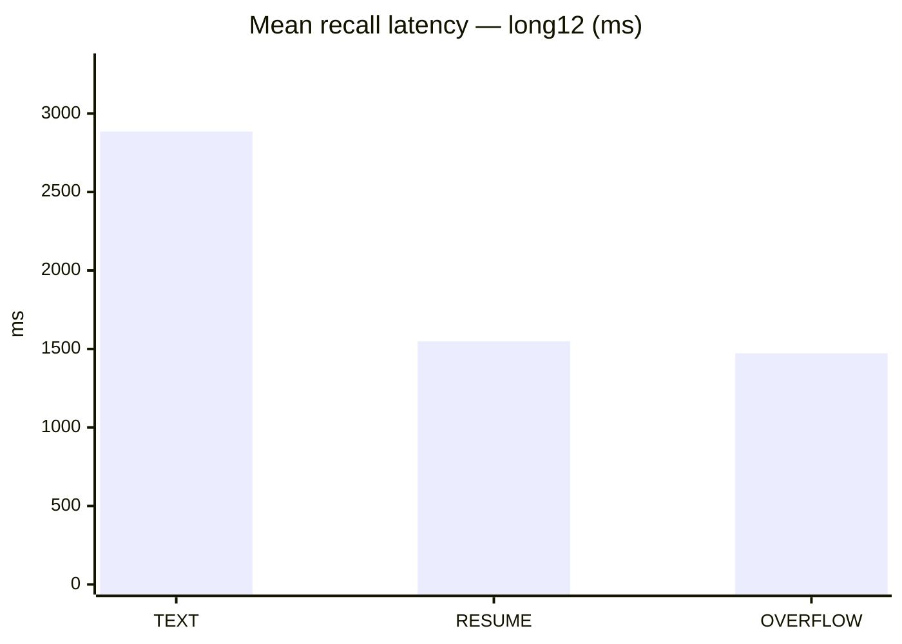

# 3 — Latency analysis

End-to-end HTTP latency from harness (`latency_ms` per request). Includes network, vLLM queue, prefill, and decode.

## Summary — long12 recall (mean / p95)

| Arm | Mean ms | p95 ms | ms per 1k prompt tok |
|-----|--------:|-------:|---------------------:|
| TEXT | 2884.9 | 4976.4 | 770.7 |
| RESUME | 1548.5 | 2114.6 | 36694.31 |
| OVERFLOW | 1472.9 | 1955.4 | — |

**Mean latency reduction (RESUME vs TEXT):** 46.3%

```mermaid
xychart-beta
    title "Per-probe latency — long12 (ms)"
    x-axis ["P1", "P2", "P3", "P4", "P5"]
    y-axis "ms" 0 --> 5722.86
    bar "TEXT" [2543.9, 1589.8, 2748.9, 2565.4, 4976.4]
    bar "RESUME" [1597.9, 1206.1, 2114.6, 1104.0, 1720.1]
```

## All scenarios (inject compare)

| Scenario | TEXT mean | RESUME mean | OVERFLOW mean |
|----------|----------:|------------:|--------------:|
| short chain (0 noise) | 1719.1 | 1973.9 | 1913.9 |
| long12 chain | 2884.9 | 1548.5 | 1472.9 |
| short OpenRouter TEXT | 1192.7 | 1489.4 | 1475.5 |
| long12 OpenRouter TEXT | 1622.9 | 1628.3 | 1617.2 |
| long12 resume_max_tokens=4096 | 2880.9 | 1483.8 | 1489.1 |

## Per-probe latency (long12)

| # | TEXT ms | RESUME ms | TEXT prompt tok | RESUME prompt tok |
|---|--------:|----------:|----------------:|------------------:|
| 1 | 2543.9 | 1597.9 | 3745 | 44 |
| 2 | 1589.8 | 1206.1 | 3742 | 41 |
| 3 | 2748.9 | 2114.6 | 3745 | 44 |
| 4 | 2565.4 | 1104.0 | 3742 | 41 |
| 5 | 4976.4 | 1720.1 | 3742 | 41 |

## Interpretation

- RESUME avoids large prefill → lower mean latency despite KV inject overhead.
- Short chain: RESUME can be slightly *slower* (inject setup dominates when context is tiny).
- Long chain: RESUME ~**1.9× faster** mean recall vs TEXT at equal correctness.

Raw: `inject_mode_compare_*_long12_postfix.json`