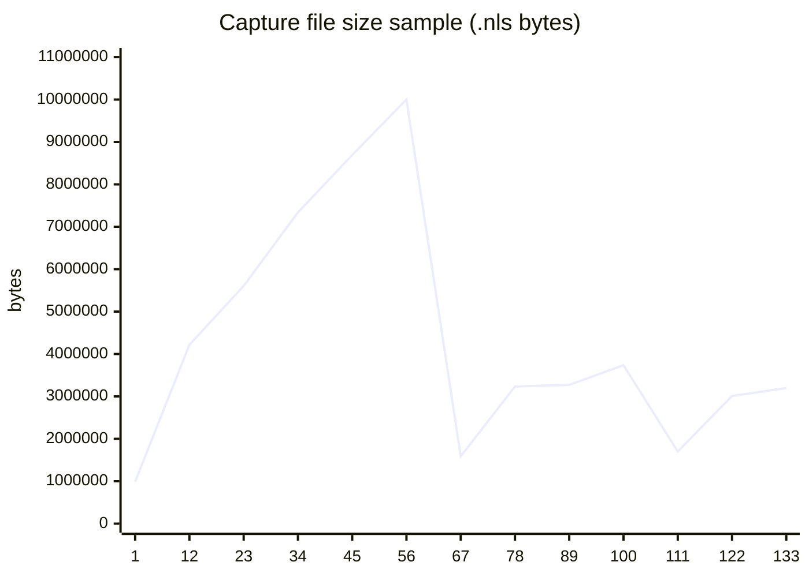

# 5 — Storage footprint

PRI persists one `.nls` capture per turn under `/data/pri/snapshot/captures/`.

## Aggregate (full turn-sweep session)

| Metric | Value |
|--------|------:|
| Capture files | 143 |
| Index rows | 143 |
| Capture disk | **648.11 MB** |
| Data dir total | 650.83 MB |
| Admin indexed tokens | 23696 |

## Per-file capture sizes (`capture_sizes.csv`)

| Stat | Bytes | MB |
|------|------:|---:|
| Total (143 files) | 679,597,212 | 648.11 |
| Mean | 4,752,428 | 4.53 |
| Median | 3,559,088 | — |
| Min / Max | 989,448 / 11,639,413 | — |
| Stdev | 2,652,082 | — |

**Bytes per inject token (chain total):** ~28866.2 B/tok (captures / `23543` inject tokens)

## Interpretation

- Capture size grows with turn length and assistant output (KV + hybrid state).
- Disk cost is **one-time per turn**; amortized over all future RESUME recalls on that chain.
- 648 MB for 83-turn production-length session ≈ **7.8 MB/turn** mean (full sweep).

Raw: `store_stats.json`, `capture_sizes.csv`, `geometry_audit_turn_sweep_v5_fixed.json`