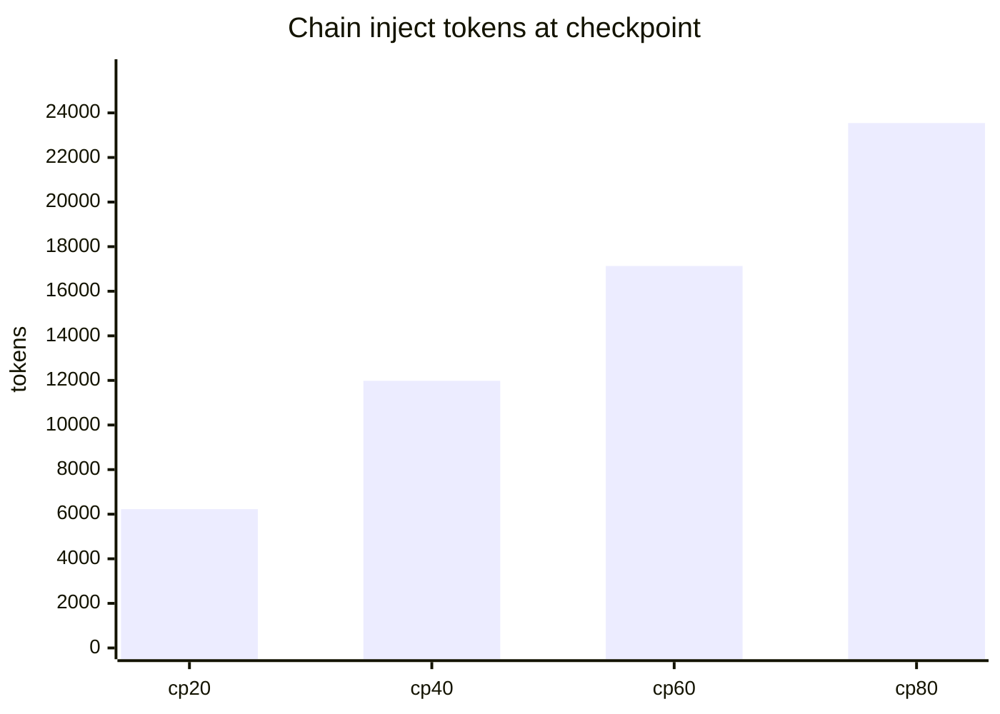

# 6 — Turn-sweep scaling

Marco facts planted once; cumulative noise turns to each checkpoint; recall @5 at cp 20/40/60/80.

## Recall vs checkpoint

| cp | turn blocks | inject tok | TEXT | RESUME | ARM-D |
|----|------------:|-----------:|:----:|:------:|:-----:|
| 20 | 23 | 6225 | 5/5 | 5/5 | 5/5 |
| 40 | 43 | 11981 | 5/5 | 5/5 | 5/5 |
| 60 | 63 | 17131 | 5/5 | 3/5 | 3/5 |
| 80 | 83 | 23543 | 5/5 | 0/5 | 0/5 |

```mermaid
xychart-beta
    title "Recall pass count @5 (turn sweep)"
    x-axis ["cp20", "cp40", "cp60", "cp80"]
    y-axis "pass / 5" 0 --> 5
    bar "TEXT" [5.0, 5.0, 5.0, 5.0]
    bar "RESUME" [5.0, 5.0, 3.0, 0.0]
    bar "ARM-D" [5.0, 5.0, 3.0, 0.0]
```

## Failure character by checkpoint

| cp | RESUME failure mode | TEXT |
|----|---------------------|------|
| 20–40 | — (5/5) | 5/5 |
| 60 | Policy refusals (3/5) | 5/5 |
| 80 | Refusals / no-hit (0/5) | 5/5 |

Garble investigation (`turn_sweep_cp60_80_garble_inv.json`) confirms TEXT 5/5 while RESUME degrades — inject-mediated decode, not missing inline context.

Raw: `turn_sweep_cp20_80_v5.json`, `turn_sweep_cp60_80_garble_inv.json`