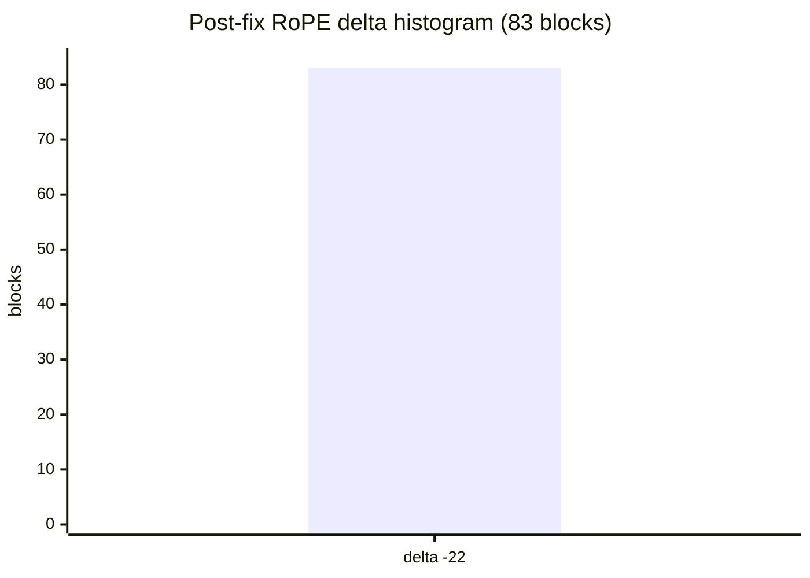

# 7 — RoPE pack geometry

## KPI: delta_uniformity

Bench metric: fraction of turn blocks sharing the same **RoPE re-rotation delta**
(`rope_new − rope_old`) in the inject pack plan. **Not** retrieval cosine similarity.

| Metric | Value | Grade |
|--------|------:|-------|
| Verdict | `pass` | — |
| Blocks | 83 | — |
| delta_uniformity | **100.0%** | excellent |
| mode RoPE Δ | -22 | uniform |
| Outliers | 0 | — |
| delta stdev | 0.0 | — |

## Pre-fix vs post-fix (phantom repair)

Pre-fix audit had **82** blocks at Δ=−22 and **1** outlier at Δ=−42 (turn 59). Post-fix: **83** / **83** uniform.

```mermaid
xychart-beta
    title "RoPE delta blocks — pre-fix vs post-fix phantom repair"
    x-axis ["Pre-fix", "Post-fix"]
    y-axis "blocks" 0 --> 85
    bar "delta -22 uniform" [82.0, 83.0]
    bar "delta -42 outlier" [1.0, 0.0]
```



## Post-fix delta histogram

All **83** blocks share mode **Δ = -22** (`delta_distribution`: {'-22': 83}).



## Post-fix status

Pre-fix audit reported 98.8% delta_uniformity (one turn-59 phantom outlier).
After **chain-pack cumulative offset** fix in `pri/resume.py` / `pri/connector.py`:

- **100%** delta_uniformity on v5 sweep chain
- **100%** on garble-investigation chain
- Geometry verdict: **`pass`**

## Manifest rope gaps (expected)

82 manifest `rope_end[i] ≠ rope_start[i+1]` gaps because each block captures with
`rope_start=22` (resume-shaped per-turn capture). **Pack offsets are contiguous.**

## Tools

```bash
python bench/tier1/geometry_audit.py --from-sweep turn_sweep_cp20_80_v5.json ...
python bench/tier1/rope_delta_microscope.py ...
```

Raw: `geometry_audit_turn_sweep_v5_fixed.json`, `rope_delta_microscope_fixed.json`
