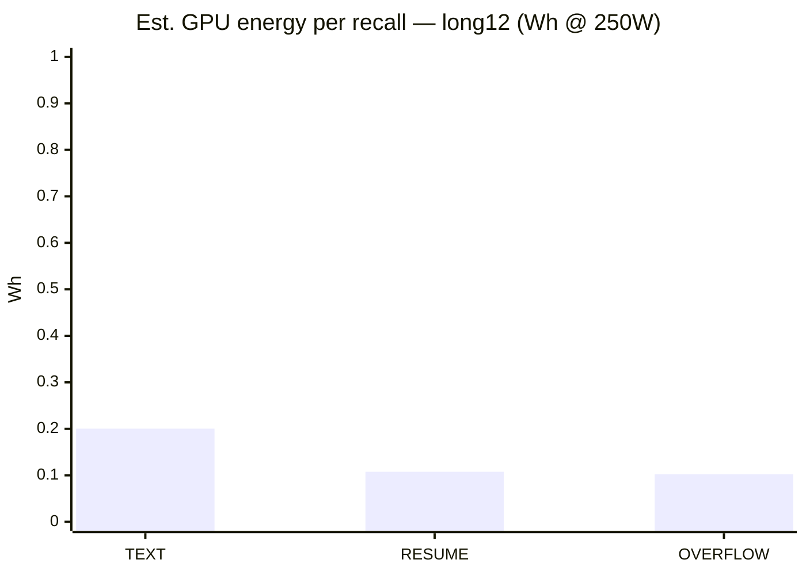
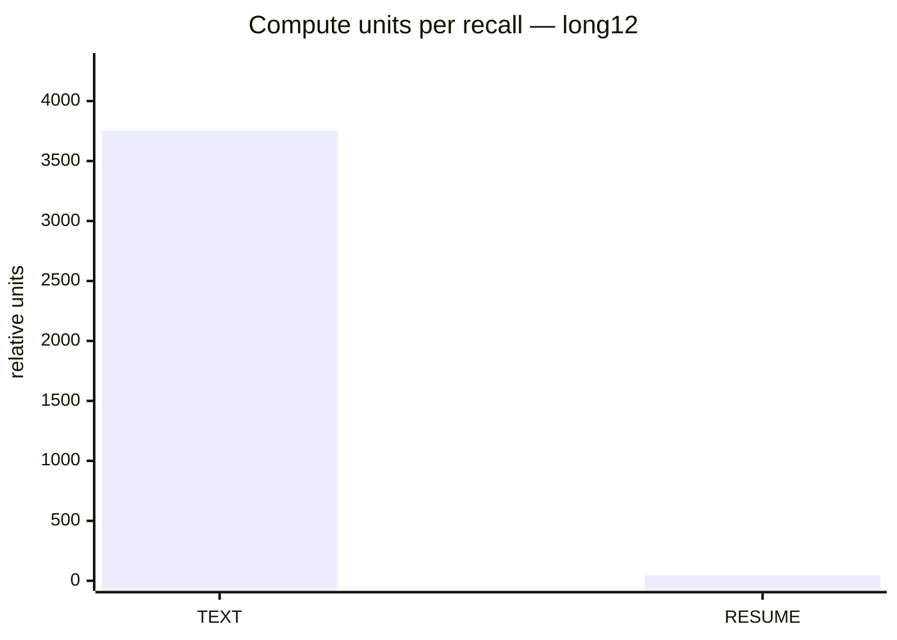
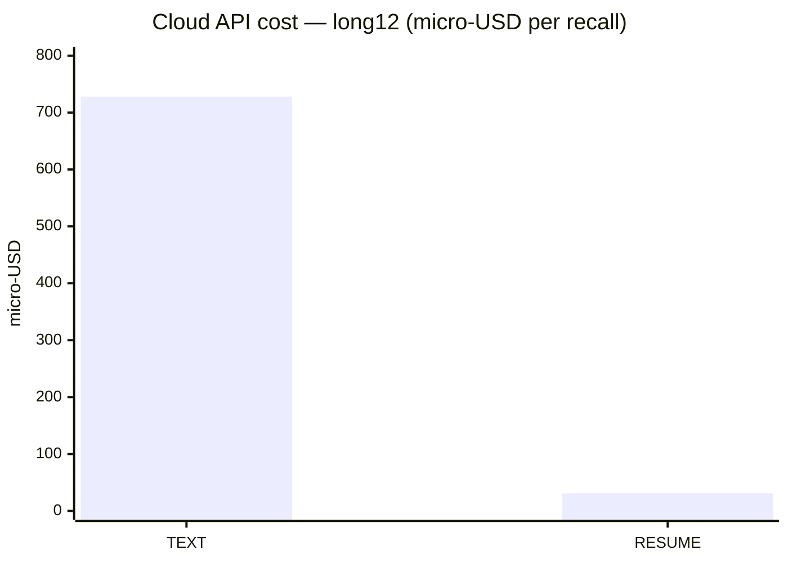

# 9 — Energy impact & cost

> GX10 overnight run did not capture wall power or SM clocks. Figures combine measured bench latency/tokens with documented assumptions below.

## Assumptions (tunable)

| Parameter | Value | Notes |
|-----------|------:|-------|
| GPU average power | **250 W** | Not measured; GB10-class inference estimate |
| PUE | 1.0 | 1.0 = on-prem wall meter; use 1.2 for colo |
| Electricity | $0.15/kWh | Illustrative |
| Cloud input | $0.18/1M tok | OpenRouter-class illustrative |
| Cloud output | $0.72/1M tok | OpenRouter-class illustrative |
| Decode weight | 0.12× | Relative to one prefill token in compute proxy |

## Models

1. **Latency × power** — `E(Wh) = P_gpu × PUE × latency(s) / 3600` using measured HTTP latency.
2. **Token compute proxy** — `units = prompt_tok + w × completion_tok` (prefill-dominated at long context).
3. **Cloud API $** — if TEXT ran on a hosted API with per-token billing vs local RESUME.

## Long12 — per successful recall (mean)

| Arm | Latency ms | Wh @ 250W | Electricity $ | Compute units | Cloud API $ |
|-----|----------:|----------:|--------------:|--------------:|------------:|
| TEXT | 2884.9 | 0.20034 | $0.000030 | 3752.18 | $0.000728 |
| RESUME | 1548.5 | 0.107535 | $0.000016 | 46.09 | $0.000031 |
| OVERFLOW | 1472.9 | 0.102285 | $0.000015 | 46.09 | $0.000031 |

### Savings (RESUME vs TEXT, long12)

| Metric | Saved | % |
|--------|------:|--:|
| GPU energy (Wh) | 0.092805 | **46.3%** |
| Compute units | 3706.09 | **98.8%** |
| Cloud API $ / recall | $0.000697 | **95.7%** |

## Power sensitivity (latency model)

| GPU power (W) | TEXT Wh | RESUME Wh | Saved | % |
|--------------:|--------:|----------:|------:|--:|
| 150 | 0.120204 | 0.064521 | 0.055683 | 46.3% |
| 250 | 0.20034 | 0.107535 | 0.092805 | 46.3% |
| 350 | 0.280476 | 0.150549 | 0.129927 | 46.3% |

**Note:** % savings is stable across power assumptions because both arms use the same multiplier.

## Turn sweep — compute proxy (token-based)

No per-request latency in sweep JSON; energy uses token proxy only at each checkpoint.

```mermaid
xychart-beta
    title "Compute units @ recall (turn sweep)"
    x-axis ["cp20", "cp40", "cp60", "cp80"]
    y-axis "relative units" 0 --> 25698.42
    bar "TEXT" [6209.2, 11906.2, 17003.2, 23362.2]
    bar "RESUME" [47.0, 47.0, 47.0, 47.0]
```

| cp | TEXT units | RESUME units | TEXT cloud $ est | RESUME cloud $ est |
|----|----------:|-------------:|-----------------:|-------------------:|
| 20 | 6209.2 | 47.0 | $0.001154 | $0.000044 |
| 40 | 11906.2 | 47.0 | $0.002179 | $0.000044 |
| 60 | 17003.2 | 47.0 | $0.003097 | $0.000044 |
| 80 | 23362.2 | 47.0 | $0.004241 | $0.000044 |

At **cp80**, RESUME still saves **>99%** compute units vs TEXT but recall is **0/5** — cheap inference that fails the task is not a net win.

## Annual projections (long12, RESUME vs TEXT)

Assumes every recall resembles the long12 inject-compare chain (15 turns planted).

| Recalls/day | GPU kWh saved/yr | Electricity $ saved/yr | Cloud API $ saved/yr | Input tokens avoided/yr |
|------------:|-----------------:|-----------------------:|---------------------:|------------------------:|
| 100 | 3.4 | $0.51 | $25.44 | 135,086,500 |
| 1,000 | 33.9 | $5.08 | $254.41 | 1,350,865,000 |
| 10,000 | 338.7 | $50.81 | $2544.05 | 13,508,650,000 |

## Interpretation

- **Electricity** savings track **latency** (~46% here) — meaningful at high QPS, modest per request.
- **Cloud API** savings track **input tokens** (~99%) — dominant if TEXT would run on a hosted per-token API.
- **On-prem GPU** deployments still benefit from shorter GPU busy time → higher throughput headroom.
- **Storage** energy is negligible vs inference; capture cost is capex/disk, not kWh (see [05_storage_footprint.md](05_storage_footprint.md)).

648 MB capture disk for 83-turn session ≈ 7.8 MB/turn one-time. At 0.005 Wh/GB-year HDD idle, storage energy is ≪ single recall inference.

## Future measurement (MoE matrix)

For publication-grade energy claims, add to the next bench pass:

- `nvidia-smi --query-gpu=power.draw` sampled per recall request
- vLLM profiler / `engine_core` prefill vs decode split
- Wall-meter validation on GX10 for at least one arm

Raw: `inject_mode_compare_*_long12_postfix.json`, assumptions in `research_data.json` → `energy_cost`