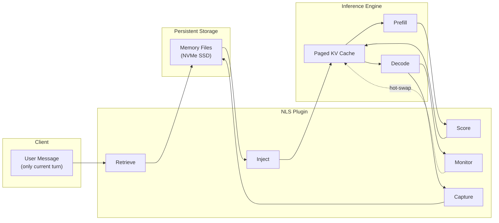
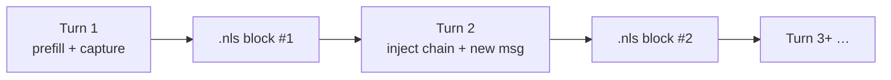

# NLS inference pipeline (architecture)

> **Part of [Punk Records Inference](index.md) documentation** — the full five-phase NLS design. This repo ships the open reference implementation (`pri/`, Docker, benches). Patent: U.S. Provisional **64/050,345**.

This document describes the NLS inference pipeline at an architectural level. Runtime implementation details: [ARCHITECTURE.md](ARCHITECTURE.md).

---

## System Overview

NLS is a plugin that integrates with LLM inference engines (e.g., vLLM) to make inference stateful. It sits between the scheduler and the model execution layer, intercepting requests to inject stored states and capturing new states after each response.




---

## Phase 1: Retrieval

When a new message arrives, the system must decide which stored memories are relevant. This is a needle-in-a-haystack problem — a user might have hundreds or thousands of stored memories across many sessions.

### Multi-Signal Fusion ("Swiss-Cheese" Retrieval)

Two complementary search methods run in parallel:

**Lexical (BM25):** Matches on exact token overlap. Fast, precise for names, numbers, and specific terms. Misses semantic paraphrases ("how old am I?" won't match a memory containing "I'm 34 years old").

**Semantic (Dense Embedding):** Encodes the query and each memory into dense vectors using a sentence-transformer. Matches on meaning regardless of wording. Catches paraphrases but can be noisy.

Both scores are normalized and fused with configurable weights (e.g., 35% lexical + 65% semantic). Additional signals are layered on top:

- **Temporal indexing** — memories carry date/time tags; queries like "last week" resolve against them
- **Recency bias** — recent memories receive a mild boost
- **Quality filtering** — a language-agnostic classifier penalizes low-information memories (greetings, reactions, questions about recall) without requiring keyword lists in any language
- **Deduplication** — semantically identical memories from different sessions are collapsed to a single representative

The result: a ranked list of the top-K most relevant memories for the current query.

---

## Phase 2: Injection

Retrieved memories are loaded from disk and injected into the inference engine's KV cache as **phantom tokens** — positions that receive real K/V values without any text being processed.

### Cache Layout

```
┌────────────────┬──────────────────────┬──────────────────────┐
│ Register Slots │ Memory Positions     │ Real Prompt Tokens    │
│ (hot-swappable)│ (phantom — no compute)│ (system + user msg)  │
└────────────────┴──────────────────────┴──────────────────────┘
```

The scheduler allocates pages for all positions but only runs the model on the real prompt tokens. The memory positions and register slots receive their K/V values from stored files.

### Position Encoding Correction

A key challenge: transformer models encode absolute position into their key vectors. A memory captured at one position must be re-positioned to wherever it's injected. NLS applies a mathematical correction so the key vector is valid at its new position — equivalent to the model having processed the text at that position.

### State Merging

Multiple memories are concatenated along the sequence dimension, with each memory's keys individually position-corrected. For hybrid models with recurrent layers (Mamba/DeltaNet), the compounding happens at **capture time** via a two-pass ingestion process — each memory file already contains properly compounded recurrent states. At query time, the system uses the genesis (baseline) recurrent state, as the attention K/V carries the factual content while recurrent states provide narrative coherence from within each stored memory.

### System Prompt Efficiency

The system prompt is captured once, deduplicated by content hash, and reused across all sessions. Individual memory captures exclude the system prompt, producing clean per-message state blocks that can be freely composed.

---

## Phase 3: Scoring (During Prefill)

Not all retrieved memories are equally relevant. The system uses the model's own attention to score them.

### How It Works

As the model processes the user's message through its layers, NLS captures the query vectors (Q) at designated scoring layers and computes dot-product attention scores against each memory region's key vectors (K). This produces a per-memory relevance score that reflects how much the model's actual attention mechanism cares about each memory for this specific query.

### Keep / Suppress Decision

Memories are ranked by their attention-derived relevance. The top-K remain active. The rest have their **value vectors zeroed** in the cache (V-suppression) — the model can still "see" they exist (keys preserved) but receives no content signal from them (values zeroed). This prevents irrelevant context from degrading output quality.

This suppression can be applied at an early layer, so the majority of the model's layers process a clean context with only the most relevant memories active.

### Quality-Aware Ranking

Raw attention scores can be misleading. A memory containing the user's name attracts strong attention on almost every query (it's an identity anchor) but carries little factual content. NLS combines attention-based ranking with multi-signal quality filtering — including both language-aware and model-native signals — so factual content reliably wins over greetings, questions, and reactions.

---

## Phase 4: Monitoring (During Decode)

Generation can span many tokens. The topic might shift mid-response. The initial memory selection might not cover everything the model needs.

### Hidden-State Probing

At regular intervals during token generation, NLS captures the model's hidden state and compares it against fingerprint vectors representing all available memories. If the hidden state drifts toward a topic covered by a memory not currently active, the system detects this via a rising similarity signal.

### Hot-Swap in Register Slots

When a new memory becomes relevant:

1. The least-relevant current register slot is identified
2. The evicted memory's values are zeroed
3. The new memory's states are loaded from disk, position-corrected, and written into the slot
4. Generation continues without interruption

This happens transparently — the model doesn't restart, doesn't re-prefill, doesn't lose its generation state. The KV cache is updated under the hood and the model's next attention operation naturally picks up the new content.

### Protection

Memories that the neural scoring phase (Phase 3) designated as important are protected from eviction. The streaming scorer can only replace unprotected or low-scoring slots.

---

## Phase 5: Capture

After the model generates its response, the newly computed states are captured for future reuse.

### What Gets Captured

- **Attention K/V tensors** from every attention layer — quantized to int8 with per-tensor scaling for ~4x compression
- **Recurrent states** (conv + SSM) from state-space model layers in hybrid architectures
- **Metadata**: user ID, session ID, role, turn index, timestamp, conversation text, integrity hashes

### What Gets Excluded

The system prompt prefix is excluded via range slicing — each memory contains only the user's message content. This produces clean, composable blocks: any combination of memories can be injected with any system prompt.

### Storage Format

A custom binary container format with a separate JSON manifest and compressed tensor payload. The manifest can be read without decompressing the tensors, enabling fast indexing and boot-time reconciliation.

### Quality Gate

Not every message is worth remembering. Before persistence, the system computes a quality score for each candidate capture. Captures below a quality threshold are rejected entirely — no state file, no embedding, no index entry. Junk never enters the memory pool.

### Integrity Chain

Each capture references the hash of the previous capture, forming a verifiable chain. Any insertion, deletion, or reordering of memories can be detected by walking the chain.

---

## Mode-Conditional Composition

The system distinguishes conversational requests from agent/tool-use requests and applies different memory composition strategies to each.

**Conversational mode (default):** Each request sends only the current user message. Captured memories are tagged with a sentinel turn-index that excludes them from chain-walk expansion, preserving pure semantic retrieval.

**Agent mode:** Auto-detected when the request contains a `tools` array, tool-result messages, or an explicit mode flag. The full message chain (prior tool calls, tool results) is forwarded to the model. Tool result messages are captured as `role: tool` memories with chain metadata linking them to their parent user message.

When an agent returns to a project after context compaction (a common failure mode of agent systems), retrieval surfaces the user's memory, and chain-walk pulls back the linked tool blocks containing operational details (IPs, configs, deploy commands) from the prior session. The agent doesn't have to rediscover what it already knows.

This mode-conditional design ensures chain-walk doesn't introduce adjacent-turn noise into conversational queries while still providing the operational continuity that agentic workflows need.

---

## Injection Modes: Retrieval vs Chain Resume

The five phases above describe **retrieval-first injection** — the path used when a user returns after days with an empty chat window and the system must search a large memory pool (validated April 2026: OpenCode 4/4 cross-session recall, 18,751 phantom tokens from a 124-token prompt).

A second mode — **chain resume** — applies within a **single agent session**:



| Property | Retrieval inject | Chain resume |
|----------|------------------|--------------|
| **Memory selection** | BM25 + embedding fusion across pool | Prior turn block(s) by `base_session` chain |
| **Phases used** | 1, 2, 3, (4), 5 | 2, 5 |
| **Typical client payload** | Current message only | Current message only |
| **Best for** | Cross-session, cold start | OpenCode / agent loops, same thread |
| **June 2026 validation** | OpenCode Apr 2026 | PRI overnight run: 5/5 recall, ~3700 tok saved |

Both modes share Phase 2 mechanics (phantom tokens, RoPE correction, system-prompt dedup) and Phase 5 capture. Chain resume **prepends the system block** before turn KV in the phantom pack so decode matches `[system][history][user]` ordering.

Implementation: [ARCHITECTURE.md](ARCHITECTURE.md) · Reproduce: [Quickstart](getting-started/quickstart.md).

---

## Production Characteristics


| Property           | Value                                                                                                        |
| ------------------ | ------------------------------------------------------------------------------------------------------------ |
| **Model agnostic** | Patches the inference engine, not the model. Works with any architecture the engine supports.                |
| **Multi-tenant**   | Memories are isolated by user ID. A single model instance serves multiple users with no cross-contamination. |
| **Persistent**     | Survives server restarts. Boot-time reconciliation rebuilds indices from stored files.                       |
| **Incremental**    | Each turn adds one small file. No reindexing or reprocessing of existing memories.                           |
| **Observable**     | Every retrieval, scoring decision, swap event, and capture is logged for debugging and transparency.         |


---

## What This Architecture Enables

Traditional LLM inference has a cost structure where every turn reprocesses all prior turns. This means the cost of a persistent AI relationship scales linearly with its length.

NLS inverts this: the cost of prior context is storage (cheap, abundant) rather than compute (expensive, bandwidth-limited). The longer the relationship, the greater the savings.

This makes a new class of applications economically viable:

- Personal AI assistants that remember years of conversation
- Therapeutic AI with genuine session continuity
- Enterprise knowledge workers that accumulate institutional memory
- Educational tutors that track learning progress across semesters

The marginal cost of memory is a disk read, not a GPU forward pass.

## Validation

The architecture has been validated end-to-end in four settings:

- **Conversational** — 5/5 production recall on the standard `prod_conversation_test` benchmark (5 facts shared across turns, then probed in a fresh session).
- **Long-context retrieval** — text-vs-KV parity on the LongMemEval 18-question benchmark (TEXT 8/18 = KV 8/18 on Qwen3.5-MoE; 9/18 = 9/18 on Qwen3.6-MoE). KV+distractor robustness matches the text ceiling.
- **Real agentic loop (cross-session)** — 4/4 cross-session recall behind the OpenCode coding-agent TUI on April 27, 2026, including disambiguating answers (frontend port 3000 vs backend port 3001 chosen by the agent in a prior session) recovered from 18,751 tokens of injected KV with a 124-token user prompt (99.3% prompt-token savings on the recall path).
- **Chain resume (same-session)** — June 2026 reproducible proof on stock Qwen3.5 hybrid: 5/5 recall vs inline TEXT on agent-length chains, ~98.9% prompt token reduction, 100% RoPE pack geometry; turn-sweep cliff documented at cp60+. See [research/00_findings.md](../bench/results/overnight_20260624_003614/research/00_findings.md).

See [BENCHMARKS.md](BENCHMARKS.md) for full methodology and results.